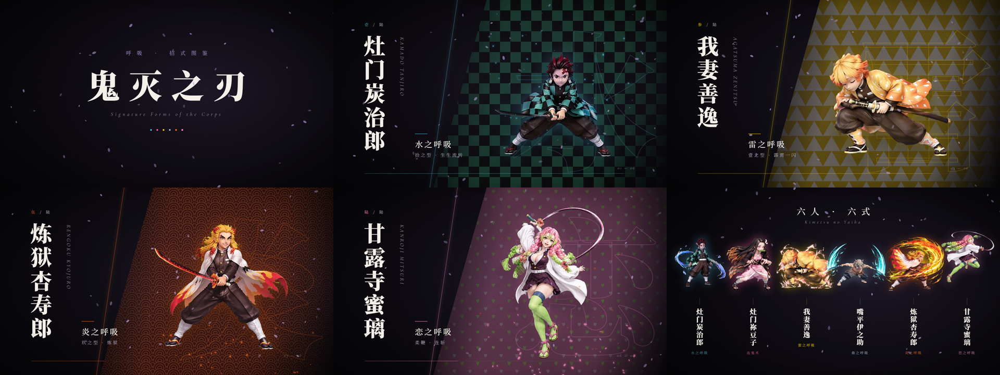
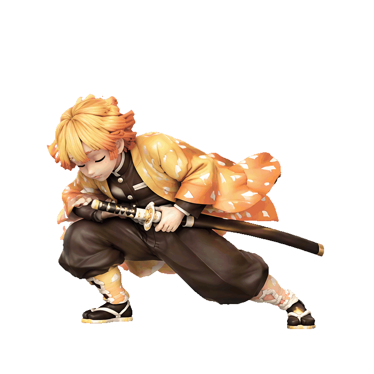
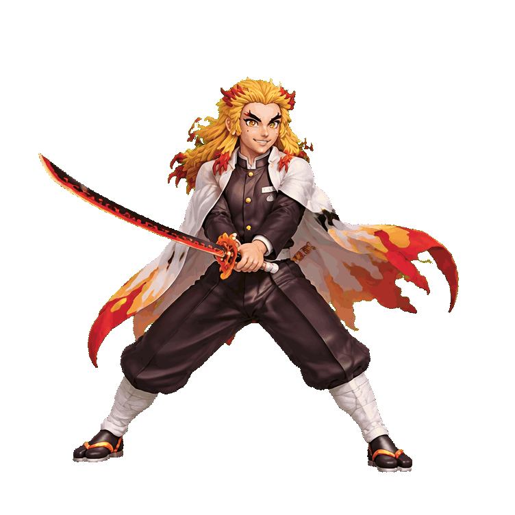
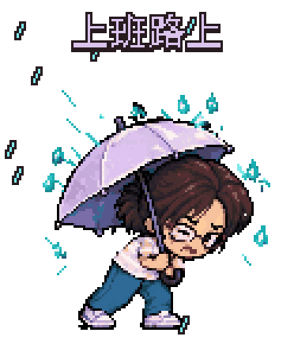
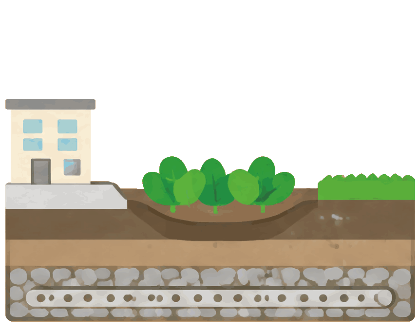
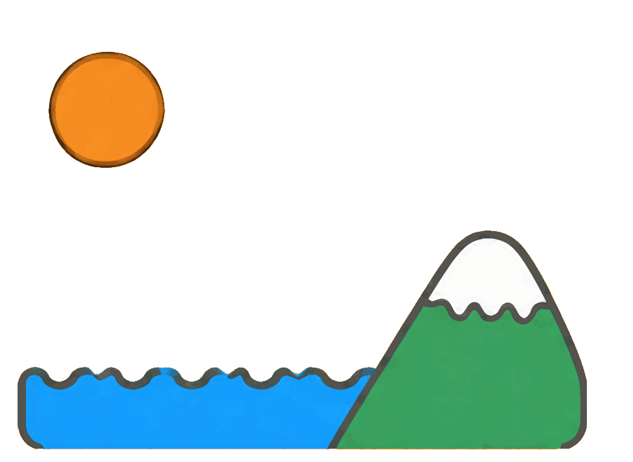

<div align="center">

# 动起来 · jisai-motion

**让角色有表情，让画面有动作，让过程看得见。**

从一句话或一张参考图，创作可以直接使用、继续修改的短动作素材。

[](https://github.com/giszzt/jisai-motion/releases)
[](https://www.python.org/)
[](LICENSE)

[看看案例](#同一个技能不同的表达) · [安装](#安装与配置) · [怎么用](#你可以直接这样说) · [交付文件](#做完之后你会拿到什么)

</div>

## 重点案例：鬼灭之刃 · 招式图鉴

六个角色，六种招式。从独立动作素材出发，组合成一支 **59.8 秒、1080p / 60 fps、带日语合成配音**的展示短片。

[](https://github.com/giszzt/jisai-motion/releases/download/v0.4.0/kimetsu-gallery-1080p60-voice.mp4)

**[打开完整有声视频（MP4，约 74 MB）→](https://github.com/giszzt/jisai-motion/releases/download/v0.4.0/kimetsu-gallery-1080p60-voice.mp4)**

<table>
<tr>
<td align="center"><br><b>水之呼吸</b></td>
<td align="center"><br><b>雷之呼吸</b></td>
<td align="center"><br><b>炎之呼吸</b></td>
</tr>
</table>

上面三张 GIF 展示可单独复用的角色动作。完整短片在动作素材之外，另行加入版式、转场、粒子和合成配音，展示素材与后续制作结合的效果。60 fps 是成片帧率，不代表每秒生成了 60 个独立姿态。此为非官方 AI 创作展示。

### 也可以从一张日常表情开始

<table>
<tr>
<td align="center"><br><b>咖啡续命</b></td>
<td align="center"><br><b>键盘冒烟了</b></td>
<td align="center"><br><b>我的伞！</b></td>
</tr>
</table>

```bash
npx skills add giszzt/jisai-motion --skill jisai-motion
```

`jisai-motion` 是一个 AI Agent Skill。装好后，把想法或参考图交给 Agent，它会设计动作、生成连续画面、切帧、调整节奏，再导出 GIF、透明 PNG 帧或短视频。也能接着处理已有动作表和帧序列。

## 好用的地方，在动作之外

**同一个角色，可以继续演。** 身份、画风和动作参考分别处理。先做一段“咖啡续命”，再沿用角色做“疯狂赶工”，可以逐个扩展成自己的动态表情套装。

**透明素材，放到哪里都方便。** 默认从第一张参考图开始准备透明背景，保留 PNG 母版。做课件、文章配图、游戏图集时，可以把素材放进自己的版面；需要夜景、室内或其他完整场景，也能保留背景。

**节奏可以改，某一帧也可以重做。** “停久一点”“最后加一个停顿”直接修改时间清单；手势不对、物体缺了一角，就针对失败帧修复。已有帧只改播放速度时，无需再次生图。

**动作设计和导出连在一起。** 生成前规划每帧要装下的运动范围，生成后检查布局和裁剪，再编码并检查播放。既能做一张动图，也能保留以后改动所需的帧与时间信息。

## 同一个技能，不同的表达

下面是作者提供的既有创作案例，保留原始 GIF 的画面与播放节奏。它们展示可尝试的方向，具体效果仍取决于参考素材、动作复杂度与图像模型。

### 把过程讲清楚

电路接通、雨水下渗、水循环，都可以拆成几个连续阶段，嵌入文章、课件或讲解页面。

<table>
<tr>
<td align="center"><br><b>从开关到亮灯</b></td>
<td align="center"><br><b>雨水去了哪里</b></td>
<td align="center"><br><b>一轮水循环</b></td>
</tr>
</table>

这些是讲解用的简化示意。用于正式教学时，还需要核对概念、方向与阶段关系。

### 让一幅画多一点呼吸

一朵花开合，一束光绕过瓶口，一只纸船在月光里漂浮。动作可以很轻，场景和气氛依然完整。

<table>
<tr>
<td align="center"><br><b>月下开花</b></td>
<td align="center"><br><b>瓶中微光</b></td>
<td align="center"><br><b>纸船夜航</b></td>
</tr>
</table>

### 简单线条，也能表达动作


火柴人、像素角色、物体、文字和特效都可以作为动作主体。单帧的比例、数量和总时长按动作决定，不固定为某一种人物模板。

如果你已经有一张动作表，也可以直接让 Agent 切成帧，核对完整性，配上时长后导出。

[浏览全部 13 张动图与视频参数 →](assets/examples/README.md)

<br clear="all">

## 你可以直接这样说

装好技能后，用自然语言描述就行。以下是使用示例，并非上方案例的原始提示词。

> 用这张角色图做一个“咖啡续命”的透明表情，喝完精神起来，最后停一下。

> 给这段水循环讲解配一张动图，按蒸发、成云、降雨、径流的顺序表现。

> 让窗边这朵花慢慢开放，保留夜景，不要移动镜头。

> 把这张动作表切成 GIF，预备动作慢一点，出手快一点，保留 PNG 帧。

> 第 5 帧的手不对，参照前后两帧修一下，其他帧和总时长保持不变。

可以告诉它用途、画风、时长、背景和最终格式，也可以先说清想表达什么，让 Agent 帮你设计。多段相似动作会先完成一个样板，再继续扩展。

## 安装与配置

### 环境要求

- [ ] 支持 Agent Skills、图片输入与工具调用的 Agent 环境。
- [ ] Python 3.10+，可运行 `python --version` 检查。
- [ ] 使用一行安装时，需要 Node.js / npx；也可以手动安装。
- [ ] 生成新画面需要内置图像工具，或配置下述 API 后端。仅处理已有帧无需生图密钥。

**一行安装：**

```bash
npx skills add giszzt/jisai-motion --skill jisai-motion
```

**让 Agent 帮你安装：**

```text
请帮我安装并配置这个 skill：
https://github.com/giszzt/jisai-motion
```

也可以克隆仓库，将整个文件夹放进平台的 skills 目录。进入实际安装目录后运行：

```bash
python -m pip install -r requirements.txt
python scripts/motion.py doctor
```

核心处理依赖 Pillow；只有导出 MP4 时才需要 ffmpeg / ffprobe。新会话没有显示技能时，重新加载会话，或明确指向安装目录中的 `SKILL.md`。

### 图像后端

优先使用 Agent 自带的图像生成能力，无需额外配置 API key。没有内置图像能力时，可使用包内 Labnana 适配器，默认模型为 `gpt-image-2.5-flare`，另提供 `sunburst` 选项；可用性以服务端实际响应为准。

将 [env.example](env.example) 复制为技能目录中的 `.env`，在本地填写：

```dotenv
LABNANA_API_KEY=
```

支持环境变量，也支持共享配置 `~/.claude/image-backends.env`。`LABNANA_BASE_URL` 可用于覆盖服务地址。密钥不需要发到对话里，`.env` 已被 Git 忽略。

```bash
python scripts/generate_frames.py precheck
```

API 生图会向所选服务发送提示词和参考图，并可能产生费用。API 路线使用纯色底生成，再在本地抠图、检查 alpha；透明失败时会报错。模型、尺寸和参考输入限制见 [生图后端](references/imagegen-backend.md)。

## 做完之后，你会拿到什么

默认交付可播放 GIF、PNG 母版帧与 `motion.json` 时间清单，同时保留报告和预览。可按用途选择 APNG、动画 WebP、图集、ZIP 或 MP4。

| 文件或格式 | 可以做什么 |
| --- | --- |
| GIF | 放进文章、聊天或课件，直接播放 |
| PNG 帧 + `motion.json` | 保留透明母版、逐帧时长，继续修帧和调节奏 |
| `preview.html` | 在本地切换播放速度与背景，检查效果 |
| `report.json` | 查看尺寸、时长、编码检查和待审项目 |
| APNG / WebP | 保留比 GIF 更细腻的透明边缘 |
| 图集 / ZIP | 整理成可复用的动作素材包 |
| MP4 | 导出普通不透明视频；需要声音时可合入音轨 |

GIF 不带声音，透明度只有两档；柔和光晕、玻璃和半透明边缘优先保留 PNG、APNG 或 WebP。MP4 需要选定背景。具体命令和清单格式见 [项目与命令](references/processing.md)。

## 当前边界与验证

当前版本为 **0.4.0**。处理器通过 49 项离线回归测试，覆盖时间、透明、切帧审核、布局、调色板和视频导出；22 项词汇触发烟测通过。案例展示与脚本测试是两类证据，都不能保证每次生成的动作自然度、角色一致性或文字稳定性。

适合短动作、局部微动和可独立使用的动作素材。长篇剪辑、精确口型同步、三维骨骼资产不在当前承诺范围。复杂运动可能需要分表或局部重生成，实际播放检查仍然必要。

开发者可在仓库根目录运行：

```bash
python -m unittest discover -s tests -v
```

维护者安装 jisai-meta-skill 后，可使用其结构校验器：

```text
python <jisai-meta-skill>/scripts/validate_skill.py <jisai-motion>
```

它不是日常使用的依赖。

<details>
<summary><b>Troubleshooting · 常见问题</b></summary>

| 问题 | 可能原因 | 处理方式 |
| --- | --- | --- |
| GIF 边缘太硬 | GIF 不支持连续透明度 | 使用 APNG / WebP，保留 PNG 母版 |
| 动作表切断了物体 | 画面越过裁剪边界 | 重新检查布局或修复原表，不能只忽略警告 |
| 动作太快 | 每个阶段停留不足 | 修改时长或使用 `retime`，无需重画 |
| 透明检查失败 | 假棋盘格或键色与主体撞色 | 重新生成或调整键色，不降低阈值掩盖问题 |
| MP4 导出失败 | ffmpeg / ffprobe 缺失，或音轨不可解码 | 运行 `doctor` 并检查输入音频 |
| 输出目录已存在 | 脚本保护已有成品 | 换一个新的输出目录 |
| 无法生成新画面 | 图像工具或 API 配置不可用 | 检查后端；已有帧仍可本地处理 |

</details>

## 致谢

参考 [0x0funky/agent-sprite-forge](https://github.com/0x0funky/agent-sprite-forge) 的生成与处理分离、共享尺度思路，以及 [Anthropic slack-gif-creator](https://github.com/anthropics/skills/tree/main/skills/slack-gif-creator) 的用途适配与导出验证方法。未复制这两个项目的实现。图像处理依赖 [Pillow](https://python-pillow.org/)，视频导出使用 [FFmpeg](https://ffmpeg.org/)。

<!-- jisai-profile:start -->
## 关于极思狂想

- 微信公众号: 极思狂想（ID: Jisairo）
- GitHub: https://github.com/giszzt

<!-- jisai-profile:end -->

## 许可证

[MIT](LICENSE) · Copyright (c) 极思狂想
